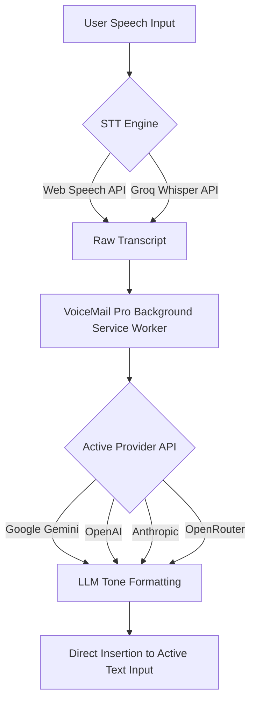

# VoiceMail Pro - AI Voice Email Writer

Convert casual voice input into professional, perfectly formatted emails instantly inside your browser.

VoiceMail Pro - AI Voice Email Writer is a lightweight, privacy-focused Chrome Extension (Manifest V3) that leverages artificial intelligence to transcribe spoken thoughts and automatically transform them into structured, high-quality emails tailored to your preferred tone.

---

## Key Features

- **Instant Speech-to-Email**: Turn rough, unedited voice notes into clean, well-structured emails in seconds.
- **Multiple Tone Profiles**: Choose between **Professional**, **Friendly**, **Formal**, or **Casual** output tones to suit any context.
- **Bring Your Own Key (BYOK)**: Connect directly to your preferred AI provider without middleman servers or subscription markups.
- **Multi-Provider Support**: 
  - **Google Gemini** (Gemini 3.5 Flash Lite, Gemini 3.1 Flash Lite, Gemma 4 26B/31B)
  - **OpenAI** (GPT-4o Mini, GPT-4o)
  - **Anthropic** (Claude 3.5 Sonnet, Claude 3 Haiku)
  - **OpenRouter** (Access to free and paid models like Llama 3.3 70B, GPT-3.5 Turbo)
  - **Groq STT / Web Speech API**: Flexible speech-to-text engines for maximum accuracy.
- **Context Menu Integration**: Right-click inside any editable text field or email composer (Gmail, Outlook, web forms) to trigger voice capture directly.
- **Direct Cursor Insertion**: Auto-populates formatted text into the active field, supporting input elements, textareas, and contenteditable containers.
- **Privacy First**: All API keys, transcripts, and settings remain strictly stored in local browser storage (`chrome.storage.local`). No analytics or remote tracking.

---

## Architecture & Flow



---

## Supported AI Providers & Models

| Provider | Supported Models | Key Benefit |
| :--- | :--- | :--- |
| **Google Gemini** | `gemini-3.5-flash-lite`, `gemini-3.1-flash-lite`, `gemma-4-26b`, `gemma-4-31b` | High speed, generous free tier via Google AI Studio |
| **OpenAI** | `gpt-4o-mini`, `gpt-4o` | Industry standard accuracy and prompt adherence |
| **Anthropic** | `claude-3-5-sonnet-20240620`, `claude-3-haiku-20240307` | Superior nuanced tone writing and clarity |
| **OpenRouter** | `openrouter/auto`, `google/gemma-4-9b-it:free`, `meta-llama/llama-3.3-70b-instruct:free` | Aggregated provider access with free model options |

---

## Installation Guide

### Prerequisites
- Google Chrome, Microsoft Edge, Brave, or any Chromium-based web browser.
- An API Key from at least one supported provider (Google Gemini, OpenAI, Anthropic, or OpenRouter).

### Manual Developer Installation
1. Clone or download this repository:
   ```bash
   git clone https://github.com/pratham-jain33/VoiceMail-Pro.git
   ```
2. Open your Chromium browser and navigate to the Extensions page:
   - Chrome: `chrome://extensions`
   - Edge: `edge://extensions`
   - Brave: `brave://extensions`
3. Enable **Developer mode** using the toggle in the top-right corner.
4. Click **Load unpacked**.
5. Select the `voicemail-pro` folder containing `manifest.json`.

---

## Getting Started & Usage

### 1. Initial Setup
1. Click the **VoiceMail Pro** icon in your browser toolbar to open the wizard.
2. Complete the step-by-step setup:
   - Enter your **Name** (used for automatic signature formatting).
   - Select your preferred **AI Provider** and **Model**.
   - Input your **API Key** for the selected provider.
   - (Optional) Configure **Speech Recognition** settings (Web Speech API or Groq STT).

### 2. Drafting Emails

#### Method A: Context Menu (Right-Click)
1. Focus on any editable text field or email compose window (e.g., Gmail, Outlook, text box).
2. Right-click inside the field.
3. Hover over **VoiceMail Pro** in the context menu and choose your desired tone (**Casual**, **Professional**, **Friendly**, or **Formal**).
4. Speak your message when prompted. VoiceMail Pro will automatically transcribe, convert, and insert the formatted email at your cursor position.

#### Method B: Extension Popup
1. Click the **VoiceMail Pro** icon in your extension bar.
2. Select your desired tone and click **Start Recording**.
3. Speak your draft. Review the generated result in the popup preview.
4. Click **Copy to Clipboard** or insert into your active document.

---

## Security & Privacy

VoiceMail Pro is designed around user privacy:
- **No Intermediary Server**: Requests are sent directly from your browser to your chosen AI provider's official endpoint.
- **Local Storage Only**: API keys, user name, and preferences are stored exclusively in Chrome local storage (`chrome.storage.local`).
- **No Third-Party Analytics**: No telemetry, tracking pixels, or data collection scripts are included.

---

## Directory Structure

```
voicemail-pro/
├── manifest.json            # Manifest V3 extension configuration
├── background.js            # Background service worker & API request handler
├── content.js               # Web page interaction & text insertion script
├── popup.html               # Main extension popup & onboarding UI
├── popup.js                 # Popup logic, provider setup, recording controller
├── setup.html               # Dedicated setup tab interface
├── setup.js                 # Setup page logic & onboarding handler
├── request-permission.js    # Audio/microphone permission requester
├── styles.css               # User interface styling
└── icons/                   # Extension icons (16px, 48px, 96px, 128px)
```

---

## Troubleshooting

- **Microphone Permission Denied**:
  Ensure microphone permissions are allowed for the extension in your browser settings (`chrome://settings/content/microphone`).
- **API Key Error**:
  Verify that your API key is active and correctly entered in the extension settings. Check provider quota limits.
- **Context Menu Not Appearing**:
  Ensure you are right-clicking inside an editable input container (`input`, `textarea`, or `contenteditable` container).

---

## License

Distributed under the MIT License. See `LICENSE` for more information.
